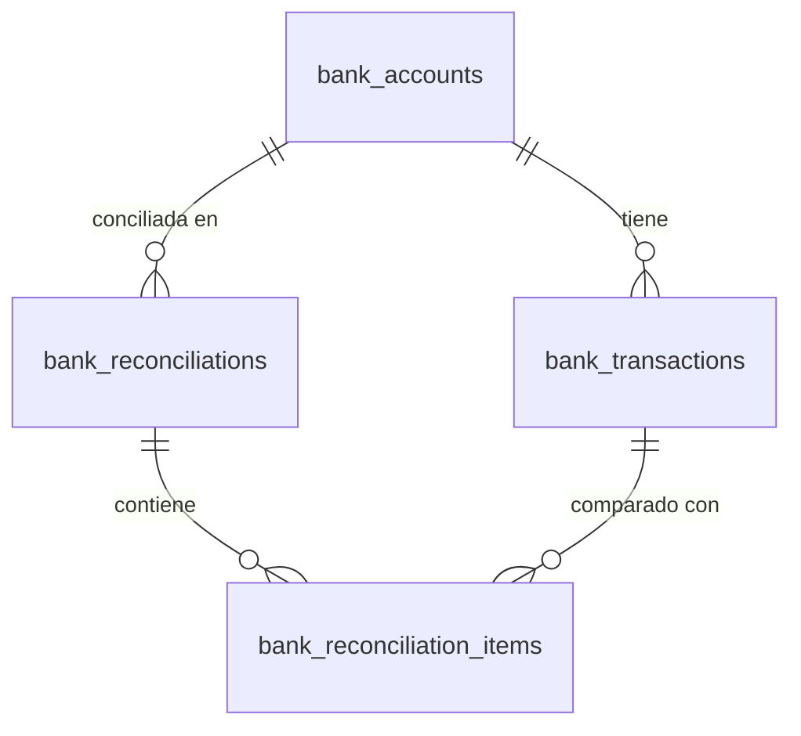

# 03 — Base de Datos

> **Contexto:** Modelo de base de datos actualizado con base en los casos de uso del proyecto, incluyendo venta en efectivo, venta a crédito, venta por sistema de apartado, devoluciones, auditoría, eventos de integración y preparación para un futuro módulo de contabilidad.

---

## Diagrama General (ERD)

```mermaid
erDiagram
    users ||--o{ user_roles : "tiene"
    roles ||--o{ user_roles : "asignado a"
    roles ||--o{ role_permissions : "incluye"
    permissions ||--o{ role_permissions : "asignado a"
    users ||--o{ activity_log : "genera"

    products }o--|| categories : "pertenece a"
    categories }o--o| categories : "subcategoría de"
    products ||--o{ product_variants : "tiene"
    sizes ||--o{ product_variants : "define"
    colors ||--o{ product_variants : "define"
    stock }o--|| product_variants : "de"
    stock }o--|| warehouses : "en"
    stock_movements }o--|| product_variants : "afecta"
    stock_movements }o--|| warehouses : "en"
    stock_reservations }o--|| product_variants : "reserva"
    stock_reservations }o--|| warehouses : "en"

    customers ||--o{ invoices : "tiene"
    customers ||--o{ layaways : "tiene"
    customers ||--o{ customer_payments : "realiza"
    customers ||--o{ customer_credit_log : "registra"

    invoices }o--|| users : "vendedor"
    invoice_items }o--|| invoices : "pertenece a"
    invoice_items }o--|| product_variants : "contiene"
    customer_payments }o--|| invoices : "abona a"
    sales_returns }o--|| invoices : "devuelve"
    sales_return_items }o--|| sales_returns : "pertenece a"
    sales_return_items }o--|| product_variants : "contiene"

    layaways }o--|| customers : "de"
    layaways }o--|| users : "vendedor"
    layaway_items }o--|| layaways : "pertenece a"
    layaway_items }o--|| product_variants : "reserva"
    layaway_payments }o--|| layaways : "abona a"
    layaway_alerts }o--|| layaways : "alerta"
    stock_reservations }o--|| layaways : "origen"

    purchase_orders }o--|| suppliers : "a"
    purchase_order_items }o--|| purchase_orders : "pertenece a"
    purchase_order_items }o--|| product_variants : "incluye"
    purchase_returns }o--|| suppliers : "a"
    purchase_return_items }o--|| purchase_returns : "pertenece a"
    purchase_return_items }o--|| product_variants : "contiene"
    supplier_payments }o--|| suppliers : "a"

    domain_events }o--|| users : "generado por"

    journal_entries }o--|| fiscal_periods : "periodo"
    journal_entries }o--|| users : "creado por"
    journal_entry_lines }o--|| journal_entries : "pertenece a"
    journal_entry_lines }o--|| chart_of_accounts : "cuenta"
```



---

## SQL — Módulo AUTH

```sql
-- Roles del sistema
CREATE TABLE roles (
    id          UUID PRIMARY KEY DEFAULT gen_random_uuid(),
    name        VARCHAR(50)  NOT NULL UNIQUE,
    description TEXT,
    is_active   BOOLEAN      NOT NULL DEFAULT TRUE,
    created_at  TIMESTAMPTZ  NOT NULL DEFAULT NOW(),
    updated_at  TIMESTAMPTZ  NOT NULL DEFAULT NOW()
);

-- Permisos granulares por módulo y acción
CREATE TABLE permissions (
    id          UUID PRIMARY KEY DEFAULT gen_random_uuid(),
    module      VARCHAR(50)  NOT NULL,
    action      VARCHAR(50)  NOT NULL,
    description TEXT,
    UNIQUE (module, action)
);

-- Relación N:N entre roles y permisos
CREATE TABLE role_permissions (
    role_id       UUID NOT NULL REFERENCES roles(id) ON DELETE CASCADE,
    permission_id UUID NOT NULL REFERENCES permissions(id) ON DELETE CASCADE,
    PRIMARY KEY (role_id, permission_id)
);

-- Usuarios del sistema
CREATE TABLE users (
    id            UUID PRIMARY KEY DEFAULT gen_random_uuid(),
    full_name     VARCHAR(100) NOT NULL,
    email         VARCHAR(150) NOT NULL UNIQUE,
    password_hash TEXT         NOT NULL,
    is_active     BOOLEAN      NOT NULL DEFAULT TRUE,
    last_login    TIMESTAMPTZ,
    created_at    TIMESTAMPTZ  NOT NULL DEFAULT NOW(),
    updated_at    TIMESTAMPTZ  NOT NULL DEFAULT NOW()
);

-- Relación N:N entre usuarios y roles
CREATE TABLE user_roles (
    user_id  UUID NOT NULL REFERENCES users(id) ON DELETE CASCADE,
    role_id  UUID NOT NULL REFERENCES roles(id) ON DELETE CASCADE,
    PRIMARY KEY (user_id, role_id)
);

-- Refresh tokens para renovar sesiones sin re-login
CREATE TABLE refresh_tokens (
    id          UUID PRIMARY KEY DEFAULT gen_random_uuid(),
    user_id     UUID        NOT NULL REFERENCES users(id) ON DELETE CASCADE,
    token_hash  TEXT        NOT NULL UNIQUE,
    expires_at  TIMESTAMPTZ NOT NULL,
    revoked     BOOLEAN     NOT NULL DEFAULT FALSE,
    revoked_at  TIMESTAMPTZ,
    created_at  TIMESTAMPTZ NOT NULL DEFAULT NOW()
);

-- Auditoría de acciones del sistema
CREATE TABLE activity_log (
    id          UUID PRIMARY KEY DEFAULT gen_random_uuid(),
    user_id     UUID         REFERENCES users(id) ON DELETE SET NULL,
    action      VARCHAR(100) NOT NULL,
    module      VARCHAR(50),
    detail      JSONB,
    ip_address  INET,
    user_agent  TEXT,
    created_at  TIMESTAMPTZ NOT NULL DEFAULT NOW()
);

CREATE INDEX idx_users_email          ON users(email);
CREATE INDEX idx_user_roles_user      ON user_roles(user_id);
CREATE INDEX idx_user_roles_role      ON user_roles(role_id);
CREATE INDEX idx_refresh_token_hash   ON refresh_tokens(token_hash);
CREATE INDEX idx_activity_user        ON activity_log(user_id);
CREATE INDEX idx_activity_module      ON activity_log(module);
CREATE INDEX idx_activity_date        ON activity_log(created_at DESC);
```

---

## SQL — Módulo INVENTORY

```sql
-- Categorías con soporte de jerarquía
CREATE TABLE categories (
    id          UUID PRIMARY KEY DEFAULT gen_random_uuid(),
    name        VARCHAR(100) NOT NULL,
    parent_id   UUID         REFERENCES categories(id) ON DELETE SET NULL,
    is_active   BOOLEAN      NOT NULL DEFAULT TRUE,
    created_at  TIMESTAMPTZ  NOT NULL DEFAULT NOW(),
    updated_at  TIMESTAMPTZ  NOT NULL DEFAULT NOW()
);

-- Catálogo global de tallas
CREATE TABLE sizes (
    id          UUID PRIMARY KEY DEFAULT gen_random_uuid(),
    code        VARCHAR(30)  NOT NULL UNIQUE,
    name        VARCHAR(50)  NOT NULL,
    sort_order  INTEGER      NOT NULL DEFAULT 0,
    is_active   BOOLEAN      NOT NULL DEFAULT TRUE,
    created_at  TIMESTAMPTZ  NOT NULL DEFAULT NOW(),
    updated_at  TIMESTAMPTZ  NOT NULL DEFAULT NOW()
);

-- Catálogo global de colores
CREATE TABLE colors (
    id          UUID PRIMARY KEY DEFAULT gen_random_uuid(),
    code        VARCHAR(30)  NOT NULL UNIQUE,
    name        VARCHAR(50)  NOT NULL,
    hex_code    VARCHAR(7),
    is_active   BOOLEAN      NOT NULL DEFAULT TRUE,
    created_at  TIMESTAMPTZ  NOT NULL DEFAULT NOW(),
    updated_at  TIMESTAMPTZ  NOT NULL DEFAULT NOW()
);

-- Catálogo de productos
CREATE TABLE products (
    id            UUID PRIMARY KEY DEFAULT gen_random_uuid(),
    code          VARCHAR(50)    NOT NULL UNIQUE,
    name          VARCHAR(150)   NOT NULL,
    description   TEXT,
    category_id   UUID           REFERENCES categories(id) ON DELETE SET NULL,
    cost_price    NUMERIC(12, 2) NOT NULL DEFAULT 0,
    sale_price    NUMERIC(12, 2) NOT NULL DEFAULT 0,
    unit          VARCHAR(20)    NOT NULL DEFAULT 'unit',
    is_active     BOOLEAN        NOT NULL DEFAULT TRUE,
    created_at    TIMESTAMPTZ    NOT NULL DEFAULT NOW(),
    updated_at    TIMESTAMPTZ    NOT NULL DEFAULT NOW(),
    CHECK (cost_price >= 0),
    CHECK (sale_price >= 0)
);

-- Variantes comercializables: talla/color para calzado o variante default para accesorios
CREATE TABLE product_variants (
    id          UUID PRIMARY KEY DEFAULT gen_random_uuid(),
    product_id  UUID           NOT NULL REFERENCES products(id) ON DELETE CASCADE,
    sku         VARCHAR(80)    NOT NULL UNIQUE,
    size_id     UUID           REFERENCES sizes(id) ON DELETE SET NULL,
    color_id    UUID           REFERENCES colors(id) ON DELETE SET NULL,
    min_stock   NUMERIC(12, 2) NOT NULL DEFAULT 0,
    is_active   BOOLEAN        NOT NULL DEFAULT TRUE,
    created_at  TIMESTAMPTZ    NOT NULL DEFAULT NOW(),
    updated_at  TIMESTAMPTZ    NOT NULL DEFAULT NOW(),
    UNIQUE (product_id, size_id, color_id),
    CHECK (min_stock >= 0)
);

-- Bodegas o puntos de almacenamiento
CREATE TABLE warehouses (
    id          UUID PRIMARY KEY DEFAULT gen_random_uuid(),
    name        VARCHAR(100) NOT NULL,
    location    VARCHAR(200),
    is_active   BOOLEAN      NOT NULL DEFAULT TRUE,
    created_at  TIMESTAMPTZ  NOT NULL DEFAULT NOW(),
    updated_at  TIMESTAMPTZ  NOT NULL DEFAULT NOW()
);

-- Stock actual por variante y bodega
CREATE TABLE stock (
    id                 UUID PRIMARY KEY DEFAULT gen_random_uuid(),
    product_variant_id UUID           NOT NULL REFERENCES product_variants(id) ON DELETE CASCADE,
    warehouse_id       UUID           NOT NULL REFERENCES warehouses(id) ON DELETE CASCADE,
    quantity           NUMERIC(12, 2) NOT NULL DEFAULT 0,
    reserved_quantity  NUMERIC(12, 2) NOT NULL DEFAULT 0,
    updated_at         TIMESTAMPTZ    NOT NULL DEFAULT NOW(),
    UNIQUE (product_variant_id, warehouse_id),
    CHECK (quantity >= 0),
    CHECK (reserved_quantity >= 0),
    CHECK (reserved_quantity <= quantity)
);

-- Reservas de stock: usado principalmente por ventas por apartado
CREATE TABLE stock_reservations (
    id                 UUID PRIMARY KEY DEFAULT gen_random_uuid(),
    product_variant_id UUID           NOT NULL REFERENCES product_variants(id),
    warehouse_id       UUID           NOT NULL REFERENCES warehouses(id),
    quantity           NUMERIC(12, 2) NOT NULL,
    source_type        VARCHAR(30)    NOT NULL, -- 'layaway'
    source_id          UUID           NOT NULL,
    status             VARCHAR(20)    NOT NULL DEFAULT 'active', -- active, released, consumed, cancelled
    created_at         TIMESTAMPTZ    NOT NULL DEFAULT NOW(),
    released_at        TIMESTAMPTZ,
    CHECK (quantity > 0)
);

-- Kardex: historial completo de movimientos de inventario
CREATE TABLE stock_movements (
    id                 UUID PRIMARY KEY DEFAULT gen_random_uuid(),
    product_variant_id UUID           NOT NULL REFERENCES product_variants(id),
    warehouse_id       UUID           NOT NULL REFERENCES warehouses(id),
    type               VARCHAR(30)    NOT NULL, -- 'in', 'out', 'adjustment', 'transfer', 'reservation', 'release'
    quantity           NUMERIC(12, 2) NOT NULL,
    quantity_before    NUMERIC(12, 2) NOT NULL,
    quantity_after     NUMERIC(12, 2) NOT NULL,
    ref_type           VARCHAR(30),             -- 'purchase_order', 'invoice', 'sales_return', 'purchase_return', 'adjustment', 'layaway'
    ref_id             UUID,
    user_id            UUID           REFERENCES users(id) ON DELETE SET NULL,
    notes              TEXT,
    created_at         TIMESTAMPTZ    NOT NULL DEFAULT NOW(),
    CHECK (quantity > 0)
);

CREATE INDEX idx_products_code              ON products(code);
CREATE INDEX idx_products_category          ON products(category_id);
CREATE INDEX idx_variants_product           ON product_variants(product_id);
CREATE INDEX idx_variants_sku               ON product_variants(sku);
CREATE INDEX idx_stock_variant              ON stock(product_variant_id);
CREATE INDEX idx_stock_warehouse            ON stock(warehouse_id);
CREATE INDEX idx_stock_reservations_source  ON stock_reservations(source_type, source_id);
CREATE INDEX idx_stock_reservations_status  ON stock_reservations(status);
CREATE INDEX idx_stock_movements_var        ON stock_movements(product_variant_id);
CREATE INDEX idx_stock_movements_ref        ON stock_movements(ref_type, ref_id);
CREATE INDEX idx_stock_movements_date       ON stock_movements(created_at DESC);
```

---

## SQL — Módulo CUSTOMERS

```sql
-- Ficha de clientes con control de crédito
CREATE TABLE customers (
    id              UUID PRIMARY KEY DEFAULT gen_random_uuid(),
    code            VARCHAR(30)    NOT NULL UNIQUE,
    full_name       VARCHAR(150)   NOT NULL,
    tax_id          VARCHAR(20),
    email           VARCHAR(150),
    phone           VARCHAR(20),
    address         TEXT,
    credit_limit    NUMERIC(12, 2) NOT NULL DEFAULT 0,
    credit_balance  NUMERIC(12, 2) NOT NULL DEFAULT 0,
    credit_enabled  BOOLEAN        NOT NULL DEFAULT FALSE,
    is_active       BOOLEAN        NOT NULL DEFAULT TRUE,
    created_at      TIMESTAMPTZ    NOT NULL DEFAULT NOW(),
    updated_at      TIMESTAMPTZ    NOT NULL DEFAULT NOW(),
    CHECK (credit_limit >= 0),
    CHECK (credit_balance >= 0)
);

-- Historial de cambios en crédito del cliente
CREATE TABLE customer_credit_log (
    id             UUID PRIMARY KEY DEFAULT gen_random_uuid(),
    customer_id    UUID           NOT NULL REFERENCES customers(id) ON DELETE CASCADE,
    type           VARCHAR(30)    NOT NULL, -- 'limit_change', 'payment', 'charge', 'adjustment'
    amount         NUMERIC(12, 2) NOT NULL,
    balance_before NUMERIC(12, 2) NOT NULL,
    balance_after  NUMERIC(12, 2) NOT NULL,
    ref_type       VARCHAR(30),
    ref_id         UUID,
    user_id        UUID           REFERENCES users(id) ON DELETE SET NULL,
    notes          TEXT,
    created_at     TIMESTAMPTZ    NOT NULL DEFAULT NOW()
);

CREATE INDEX idx_customers_code       ON customers(code);
CREATE INDEX idx_customers_tax_id     ON customers(tax_id);
CREATE INDEX idx_credit_log_customer  ON customer_credit_log(customer_id);
CREATE INDEX idx_credit_log_date      ON customer_credit_log(created_at DESC);
```

---

## SQL — Módulo SUPPLIERS

```sql
-- Ficha de proveedores
CREATE TABLE suppliers (
    id                  UUID PRIMARY KEY DEFAULT gen_random_uuid(),
    code                VARCHAR(30)    NOT NULL UNIQUE,
    name                VARCHAR(150)   NOT NULL,
    tax_id              VARCHAR(20),
    email               VARCHAR(150),
    phone               VARCHAR(20),
    contact_name        VARCHAR(100),
    address             TEXT,
    outstanding_balance NUMERIC(12, 2) NOT NULL DEFAULT 0,
    is_active           BOOLEAN        NOT NULL DEFAULT TRUE,
    created_at          TIMESTAMPTZ    NOT NULL DEFAULT NOW(),
    updated_at          TIMESTAMPTZ    NOT NULL DEFAULT NOW(),
    CHECK (outstanding_balance >= 0)
);

-- Órdenes de compra a proveedores
CREATE TABLE purchase_orders (
    id           UUID PRIMARY KEY DEFAULT gen_random_uuid(),
    supplier_id  UUID           NOT NULL REFERENCES suppliers(id),
    user_id      UUID           REFERENCES users(id) ON DELETE SET NULL,
    status       VARCHAR(20)    NOT NULL DEFAULT 'draft', -- draft, sent, partial, received, cancelled
    total        NUMERIC(12, 2) NOT NULL DEFAULT 0,
    expected_at  DATE,
    notes        TEXT,
    created_at   TIMESTAMPTZ    NOT NULL DEFAULT NOW(),
    updated_at   TIMESTAMPTZ    NOT NULL DEFAULT NOW(),
    CHECK (total >= 0)
);

-- Líneas de la orden de compra
CREATE TABLE purchase_order_items (
    id                 UUID PRIMARY KEY DEFAULT gen_random_uuid(),
    purchase_order_id  UUID           NOT NULL REFERENCES purchase_orders(id) ON DELETE CASCADE,
    product_variant_id UUID           NOT NULL REFERENCES product_variants(id),
    quantity           NUMERIC(12, 2) NOT NULL,
    quantity_received  NUMERIC(12, 2) NOT NULL DEFAULT 0,
    unit_price         NUMERIC(12, 2) NOT NULL,
    subtotal           NUMERIC(12, 2) GENERATED ALWAYS AS (quantity * unit_price) STORED,
    CHECK (quantity > 0),
    CHECK (quantity_received >= 0),
    CHECK (quantity_received <= quantity),
    CHECK (unit_price >= 0)
);

-- Devoluciones o correcciones a proveedor
CREATE TABLE purchase_returns (
    id                UUID PRIMARY KEY DEFAULT gen_random_uuid(),
    supplier_id       UUID           NOT NULL REFERENCES suppliers(id),
    purchase_order_id UUID           REFERENCES purchase_orders(id) ON DELETE SET NULL,
    user_id           UUID           REFERENCES users(id) ON DELETE SET NULL,
    status            VARCHAR(20)    NOT NULL DEFAULT 'posted', -- draft, posted, cancelled
    reason            TEXT           NOT NULL,
    total             NUMERIC(12, 2) NOT NULL DEFAULT 0,
    created_at        TIMESTAMPTZ    NOT NULL DEFAULT NOW(),
    updated_at        TIMESTAMPTZ    NOT NULL DEFAULT NOW(),
    CHECK (total >= 0)
);

CREATE TABLE purchase_return_items (
    id                 UUID PRIMARY KEY DEFAULT gen_random_uuid(),
    purchase_return_id UUID           NOT NULL REFERENCES purchase_returns(id) ON DELETE CASCADE,
    product_variant_id UUID           NOT NULL REFERENCES product_variants(id),
    quantity           NUMERIC(12, 2) NOT NULL,
    unit_price         NUMERIC(12, 2) NOT NULL,
    subtotal           NUMERIC(12, 2) NOT NULL,
    CHECK (quantity > 0),
    CHECK (unit_price >= 0),
    CHECK (subtotal >= 0)
);

-- Pagos registrados a proveedores
CREATE TABLE supplier_payments (
    id          UUID PRIMARY KEY DEFAULT gen_random_uuid(),
    supplier_id UUID           NOT NULL REFERENCES suppliers(id),
    amount      NUMERIC(12, 2) NOT NULL,
    method      VARCHAR(30)    NOT NULL, -- 'cash', 'transfer', 'check'
    reference   VARCHAR(100),
    user_id     UUID           REFERENCES users(id) ON DELETE SET NULL,
    paid_at     TIMESTAMPTZ    NOT NULL DEFAULT NOW(),
    created_at  TIMESTAMPTZ    NOT NULL DEFAULT NOW(),
    CHECK (amount > 0)
);

CREATE INDEX idx_suppliers_code              ON suppliers(code);
CREATE INDEX idx_purchase_orders_supplier    ON purchase_orders(supplier_id);
CREATE INDEX idx_purchase_orders_status      ON purchase_orders(status);
CREATE INDEX idx_purchase_returns_supplier   ON purchase_returns(supplier_id);
CREATE INDEX idx_supplier_payments_supplier  ON supplier_payments(supplier_id);
CREATE INDEX idx_supplier_payments_paid_at   ON supplier_payments(paid_at DESC);
```

---

## SQL — Módulo SALES

```sql
-- Facturas de venta
CREATE TABLE invoices (
    id                  UUID PRIMARY KEY DEFAULT gen_random_uuid(),
    series              VARCHAR(10)    NOT NULL,
    number              VARCHAR(20)    NOT NULL,
    customer_id         UUID           REFERENCES customers(id) ON DELETE SET NULL,
    user_id             UUID           REFERENCES users(id) ON DELETE SET NULL,
    type                VARCHAR(20)    NOT NULL DEFAULT 'invoice', -- invoice, credit_note
    sale_type           VARCHAR(20)    NOT NULL DEFAULT 'cash', -- cash, credit, layaway_completion
    status              VARCHAR(20)    NOT NULL DEFAULT 'issued', -- issued, paid, partial, cancelled
    subtotal            NUMERIC(12, 2) NOT NULL DEFAULT 0,
    discount            NUMERIC(12, 2) NOT NULL DEFAULT 0,
    tax                 NUMERIC(12, 2) NOT NULL DEFAULT 0,
    total               NUMERIC(12, 2) NOT NULL DEFAULT 0,
    outstanding_balance NUMERIC(12, 2) NOT NULL DEFAULT 0,
    notes               TEXT,
    issued_at           TIMESTAMPTZ    NOT NULL DEFAULT NOW(),
    created_at          TIMESTAMPTZ    NOT NULL DEFAULT NOW(),
    updated_at          TIMESTAMPTZ    NOT NULL DEFAULT NOW(),
    UNIQUE (series, number),
    CHECK (subtotal >= 0),
    CHECK (discount >= 0),
    CHECK (tax >= 0),
    CHECK (total >= 0),
    CHECK (outstanding_balance >= 0)
);

-- Líneas de factura
CREATE TABLE invoice_items (
    id                 UUID PRIMARY KEY DEFAULT gen_random_uuid(),
    invoice_id         UUID           NOT NULL REFERENCES invoices(id) ON DELETE CASCADE,
    product_variant_id UUID           NOT NULL REFERENCES product_variants(id),
    quantity           NUMERIC(12, 2) NOT NULL,
    unit_price         NUMERIC(12, 2) NOT NULL,
    discount           NUMERIC(12, 2) NOT NULL DEFAULT 0,
    subtotal           NUMERIC(12, 2) NOT NULL,
    CHECK (quantity > 0),
    CHECK (unit_price >= 0),
    CHECK (discount >= 0),
    CHECK (subtotal >= 0)
);

-- Ventas por sistema de apartado
CREATE TABLE layaways (
    id                      UUID PRIMARY KEY DEFAULT gen_random_uuid(),
    number                  VARCHAR(30)    NOT NULL UNIQUE,
    customer_id             UUID           NOT NULL REFERENCES customers(id),
    user_id                 UUID           REFERENCES users(id) ON DELETE SET NULL,
    status                  VARCHAR(20)    NOT NULL DEFAULT 'active', -- active, paid, overdue, cancelled, converted
    subtotal                NUMERIC(12, 2) NOT NULL DEFAULT 0,
    discount                NUMERIC(12, 2) NOT NULL DEFAULT 0,
    tax                     NUMERIC(12, 2) NOT NULL DEFAULT 0,
    total                   NUMERIC(12, 2) NOT NULL DEFAULT 0,
    initial_payment_percent NUMERIC(5, 2)  NOT NULL DEFAULT 0,
    initial_payment_amount  NUMERIC(12, 2) NOT NULL DEFAULT 0,
    paid_amount             NUMERIC(12, 2) NOT NULL DEFAULT 0,
    outstanding_balance     NUMERIC(12, 2) NOT NULL DEFAULT 0,
    due_date                DATE           NOT NULL,
    completed_at            TIMESTAMPTZ,
    cancelled_at            TIMESTAMPTZ,
    converted_invoice_id    UUID           REFERENCES invoices(id) ON DELETE SET NULL,
    notes                   TEXT,
    created_at              TIMESTAMPTZ    NOT NULL DEFAULT NOW(),
    updated_at              TIMESTAMPTZ    NOT NULL DEFAULT NOW(),
    CHECK (subtotal >= 0),
    CHECK (discount >= 0),
    CHECK (tax >= 0),
    CHECK (total >= 0),
    CHECK (initial_payment_percent >= 0),
    CHECK (initial_payment_percent <= 100),
    CHECK (initial_payment_amount >= 0),
    CHECK (paid_amount >= 0),
    CHECK (outstanding_balance >= 0)
);

-- Productos apartados
CREATE TABLE layaway_items (
    id                 UUID PRIMARY KEY DEFAULT gen_random_uuid(),
    layaway_id         UUID           NOT NULL REFERENCES layaways(id) ON DELETE CASCADE,
    product_variant_id UUID           NOT NULL REFERENCES product_variants(id),
    warehouse_id       UUID           NOT NULL REFERENCES warehouses(id),
    quantity           NUMERIC(12, 2) NOT NULL,
    unit_price         NUMERIC(12, 2) NOT NULL,
    discount           NUMERIC(12, 2) NOT NULL DEFAULT 0,
    subtotal           NUMERIC(12, 2) NOT NULL,
    CHECK (quantity > 0),
    CHECK (unit_price >= 0),
    CHECK (discount >= 0),
    CHECK (subtotal >= 0)
);

-- Pagos de apartado
CREATE TABLE layaway_payments (
    id          UUID PRIMARY KEY DEFAULT gen_random_uuid(),
    layaway_id  UUID           NOT NULL REFERENCES layaways(id) ON DELETE CASCADE,
    amount      NUMERIC(12, 2) NOT NULL,
    method      VARCHAR(30)    NOT NULL, -- cash, transfer, card
    reference   VARCHAR(100),
    user_id     UUID           REFERENCES users(id) ON DELETE SET NULL,
    paid_at     TIMESTAMPTZ    NOT NULL DEFAULT NOW(),
    created_at  TIMESTAMPTZ    NOT NULL DEFAULT NOW(),
    CHECK (amount > 0)
);

-- Alertas de apartado vencido o próximo a vencer
CREATE TABLE layaway_alerts (
    id          UUID PRIMARY KEY DEFAULT gen_random_uuid(),
    layaway_id  UUID        NOT NULL REFERENCES layaways(id) ON DELETE CASCADE,
    type        VARCHAR(30) NOT NULL, -- due_soon, overdue
    status      VARCHAR(20) NOT NULL DEFAULT 'open', -- open, acknowledged, resolved
    message     TEXT        NOT NULL,
    generated_at TIMESTAMPTZ NOT NULL DEFAULT NOW(),
    resolved_at  TIMESTAMPTZ,
    user_id       UUID REFERENCES users(id) ON DELETE SET NULL
);

-- Pagos recibidos de clientes para facturas
CREATE TABLE customer_payments (
    id          UUID PRIMARY KEY DEFAULT gen_random_uuid(),
    invoice_id  UUID           NOT NULL REFERENCES invoices(id),
    customer_id UUID           NOT NULL REFERENCES customers(id),
    amount      NUMERIC(12, 2) NOT NULL,
    method      VARCHAR(30)    NOT NULL, -- cash, transfer, card
    reference   VARCHAR(100),
    user_id     UUID           REFERENCES users(id) ON DELETE SET NULL,
    paid_at     TIMESTAMPTZ    NOT NULL DEFAULT NOW(),
    created_at  TIMESTAMPTZ    NOT NULL DEFAULT NOW(),
    CHECK (amount > 0)
);

-- Devoluciones de cliente / notas de crédito sobre una factura emitida
CREATE TABLE sales_returns (
    id          UUID PRIMARY KEY DEFAULT gen_random_uuid(),
    invoice_id  UUID           NOT NULL REFERENCES invoices(id),
    customer_id UUID           REFERENCES customers(id) ON DELETE SET NULL,
    user_id     UUID           REFERENCES users(id) ON DELETE SET NULL,
    status      VARCHAR(20)    NOT NULL DEFAULT 'posted', -- draft, posted, cancelled
    reason      TEXT           NOT NULL,
    total       NUMERIC(12, 2) NOT NULL DEFAULT 0,
    created_at  TIMESTAMPTZ    NOT NULL DEFAULT NOW(),
    updated_at  TIMESTAMPTZ    NOT NULL DEFAULT NOW(),
    CHECK (total >= 0)
);

CREATE TABLE sales_return_items (
    id                 UUID PRIMARY KEY DEFAULT gen_random_uuid(),
    sales_return_id    UUID           NOT NULL REFERENCES sales_returns(id) ON DELETE CASCADE,
    product_variant_id UUID           NOT NULL REFERENCES product_variants(id),
    quantity           NUMERIC(12, 2) NOT NULL,
    unit_price         NUMERIC(12, 2) NOT NULL,
    subtotal           NUMERIC(12, 2) NOT NULL,
    CHECK (quantity > 0),
    CHECK (unit_price >= 0),
    CHECK (subtotal >= 0)
);

CREATE INDEX idx_invoices_customer           ON invoices(customer_id);
CREATE INDEX idx_invoices_status             ON invoices(status);
CREATE INDEX idx_invoices_sale_type          ON invoices(sale_type);
CREATE INDEX idx_invoices_issued_at          ON invoices(issued_at DESC);
CREATE INDEX idx_invoices_series_num         ON invoices(series, number);
CREATE INDEX idx_customer_payments_invoice   ON customer_payments(invoice_id);
CREATE INDEX idx_customer_payments_customer  ON customer_payments(customer_id);
CREATE INDEX idx_customer_payments_paid_at   ON customer_payments(paid_at DESC);
CREATE INDEX idx_sales_returns_invoice       ON sales_returns(invoice_id);
CREATE INDEX idx_layaways_customer           ON layaways(customer_id);
CREATE INDEX idx_layaways_status             ON layaways(status);
CREATE INDEX idx_layaways_due_date           ON layaways(due_date);
CREATE INDEX idx_layaway_items_layaway       ON layaway_items(layaway_id);
CREATE INDEX idx_layaway_payments_layaway    ON layaway_payments(layaway_id);
CREATE INDEX idx_layaway_alerts_status       ON layaway_alerts(status);
```

---

## SQL — Módulo INTEGRATION EVENTS

```sql
-- Eventos internos para integrar módulos y preparar contabilidad futura
CREATE TABLE domain_events (
    id             UUID PRIMARY KEY DEFAULT gen_random_uuid(),
    event_type     VARCHAR(100) NOT NULL,
    source_module  VARCHAR(50)  NOT NULL,
    source_type    VARCHAR(50)  NOT NULL,
    source_id      UUID         NOT NULL,
    payload        JSONB        NOT NULL DEFAULT '{}'::jsonb,
    status         VARCHAR(20)  NOT NULL DEFAULT 'pending', -- pending, processed, failed
    attempts       INTEGER      NOT NULL DEFAULT 0,
    error_message  TEXT,
    created_by     UUID         REFERENCES users(id) ON DELETE SET NULL,
    created_at     TIMESTAMPTZ  NOT NULL DEFAULT NOW(),
    processed_at   TIMESTAMPTZ
);

CREATE INDEX idx_domain_events_type        ON domain_events(event_type);
CREATE INDEX idx_domain_events_status      ON domain_events(status);
CREATE INDEX idx_domain_events_source      ON domain_events(source_module, source_type, source_id);
CREATE INDEX idx_domain_events_created_at  ON domain_events(created_at DESC);
```

### Eventos sugeridos

| Evento | Módulo origen | Uso esperado |
|--------|---------------|--------------|
| `invoice_issued` | sales | Factura emitida |
| `invoice_cancelled` | sales | Reversa de factura |
| `credit_note_issued` | sales | Nota de crédito o devolución |
| `customer_payment_received` | sales / customers | Pago recibido de cliente |
| `layaway_created` | sales | Apartado creado y stock reservado |
| `layaway_payment_received` | sales | Abono recibido para apartado |
| `layaway_completed` | sales | Apartado pagado y listo para cierre/facturación |
| `layaway_overdue` | sales | Apartado vencido luego de 2 meses |
| `purchase_order_received` | suppliers / inventory | Mercancía recibida |
| `supplier_invoice_registered` | suppliers | Factura de proveedor registrada |
| `supplier_payment_registered` | suppliers | Pago a proveedor registrado |
| `inventory_adjustment_registered` | inventory | Ajuste de inventario |

---

## SQL — Módulo ACCOUNTING (propuesta futura)

```sql
-- Catálogo de cuentas contables
CREATE TABLE chart_of_accounts (
    id          UUID PRIMARY KEY DEFAULT gen_random_uuid(),
    code        VARCHAR(30)  NOT NULL UNIQUE,
    name        VARCHAR(150) NOT NULL,
    type        VARCHAR(30)  NOT NULL, -- asset, liability, equity, revenue, expense
    parent_id   UUID         REFERENCES chart_of_accounts(id) ON DELETE SET NULL,
    is_active   BOOLEAN      NOT NULL DEFAULT TRUE,
    created_at  TIMESTAMPTZ  NOT NULL DEFAULT NOW(),
    updated_at  TIMESTAMPTZ  NOT NULL DEFAULT NOW()
);

-- Períodos fiscales
CREATE TABLE fiscal_periods (
    id          UUID PRIMARY KEY DEFAULT gen_random_uuid(),
    name        VARCHAR(100) NOT NULL,
    start_date  DATE         NOT NULL,
    end_date    DATE         NOT NULL,
    status      VARCHAR(20)  NOT NULL DEFAULT 'open', -- open, closed
    closed_at   TIMESTAMPTZ,
    created_at  TIMESTAMPTZ  NOT NULL DEFAULT NOW(),
    CHECK (end_date >= start_date)
);

-- Reglas para mapear eventos operativos a cuentas contables
CREATE TABLE accounting_rules (
    id             UUID PRIMARY KEY DEFAULT gen_random_uuid(),
    event_type     VARCHAR(100) NOT NULL,
    description    TEXT,
    debit_account_id  UUID REFERENCES chart_of_accounts(id) ON DELETE RESTRICT,
    credit_account_id UUID REFERENCES chart_of_accounts(id) ON DELETE RESTRICT,
    is_active      BOOLEAN      NOT NULL DEFAULT TRUE,
    created_at     TIMESTAMPTZ  NOT NULL DEFAULT NOW(),
    updated_at     TIMESTAMPTZ  NOT NULL DEFAULT NOW()
);

-- Encabezado de asiento contable
CREATE TABLE journal_entries (
    id             UUID PRIMARY KEY DEFAULT gen_random_uuid(),
    entry_number   VARCHAR(30)  NOT NULL UNIQUE,
    period_id      UUID         REFERENCES fiscal_periods(id) ON DELETE SET NULL,
    source_event_id UUID        REFERENCES domain_events(id) ON DELETE SET NULL,
    source_module  VARCHAR(50),
    source_type    VARCHAR(50),
    source_id      UUID,
    description    TEXT,
    status         VARCHAR(20)  NOT NULL DEFAULT 'draft', -- draft, posted, reversed
    created_by     UUID         REFERENCES users(id) ON DELETE SET NULL,
    posted_at      TIMESTAMPTZ,
    reversed_at    TIMESTAMPTZ,
    created_at     TIMESTAMPTZ  NOT NULL DEFAULT NOW(),
    updated_at     TIMESTAMPTZ  NOT NULL DEFAULT NOW()
);

-- Líneas débito/crédito de asiento contable
CREATE TABLE journal_entry_lines (
    id               UUID PRIMARY KEY DEFAULT gen_random_uuid(),
    journal_entry_id UUID           NOT NULL REFERENCES journal_entries(id) ON DELETE CASCADE,
    account_id       UUID           NOT NULL REFERENCES chart_of_accounts(id) ON DELETE RESTRICT,
    description      TEXT,
    debit            NUMERIC(12, 2) NOT NULL DEFAULT 0,
    credit           NUMERIC(12, 2) NOT NULL DEFAULT 0,
    CHECK (debit >= 0),
    CHECK (credit >= 0),
    CHECK ((debit > 0 AND credit = 0) OR (credit > 0 AND debit = 0))
);

CREATE INDEX idx_accounts_code          ON chart_of_accounts(code);
CREATE INDEX idx_journal_entries_period ON journal_entries(period_id);
CREATE INDEX idx_journal_entries_source ON journal_entries(source_module, source_type, source_id);
CREATE INDEX idx_journal_lines_entry    ON journal_entry_lines(journal_entry_id);
CREATE INDEX idx_journal_lines_account  ON journal_entry_lines(account_id);
```

---

## Reglas sugeridas para venta por sistema de apartado

| Regla | Descripción |
|-------|-------------|
| Porcentaje inicial | El sistema debe exigir un porcentaje mínimo del total para crear el apartado. El porcentaje debe ser configurable por el negocio. |
| Plazo máximo | El cliente tiene un máximo de 2 meses para completar el pago restante. |
| Pagos parciales | El sistema debe permitir registrar múltiples abonos hasta completar el saldo. |
| Reserva de inventario | Los productos apartados deben quedar reservados mientras el apartado esté activo. |
| Alerta de vencimiento | Al cumplirse 2 meses sin pago completo, el sistema debe marcar el apartado como vencido y generar una alerta. |
| Liberación de inventario | La liberación del inventario de un apartado vencido debe depender de una política configurable del negocio. |
| Conversión a factura | Al completar el pago del apartado, el sistema debe permitir cerrar el apartado y generar la factura o documento final según el flujo operativo definido. |

---

## Decisiones de Diseño

| Patrón | Dónde | Razón |
|--------|-------|-------|
| `UUID` como PK | Todas las tablas | Seguridad, no expone IDs secuenciales, facilita distribución |
| `is_active` (soft delete) | `products`, `customers`, `suppliers`, `users`, catálogos | Preservar historial sin eliminar registros |
| `sizes` y `colors` | Inventario | Catálogos reutilizables para variantes de calzado |
| `product_variants` | Inventario | Permite stock por talla/color y una variante default para artículos sin variante visible |
| `reserved_quantity` en `stock` | Inventario | Permite controlar productos apartados sin descontarlos todavía del inventario físico |
| `stock_reservations` | Inventario / Apartados | Trazabilidad de productos reservados por apartado |
| `outstanding_balance` en `invoices` | Ventas | Evitar JOIN costoso para saber si una factura tiene saldo |
| `layaways` | Ventas | Modela el sistema de apartado sin mezclarlo con factura final |
| `layaway_alerts` | Ventas | Permite alertar apartados próximos a vencer o vencidos |
| `quantity_before` y `quantity_after` | Inventario | Auditoría completa sin recalcular kardex |
| `ref_type` + `ref_id` | Inventario y eventos | Referencia polimórfica al documento origen |
| `credit_balance` en `customers` | Clientes | Saldo de crédito usado, actualizado en cada factura/pago |
| `domain_events` | Integración | Permite desacoplar contabilidad y otros procesos futuros |
| `chart_of_accounts` y `journal_entries` | Contabilidad | Preparan el módulo contable sin acoplarlo a ventas o inventario |
| `GENERATED ALWAYS AS` en `subtotal` | `purchase_order_items` | Columna calculada automáticamente por PostgreSQL |
| Sin tablas de cotización | Ventas | El negocio opera con venta directa, crédito y apartado; no se modelan presupuestos en la primera versión |

---

## Mejoras y observaciones adicionales

1. **Agregar restricciones `CHECK`**  
   Es recomendable validar montos positivos, porcentajes entre 0 y 100, saldos no negativos y cantidades mayores a cero desde la base de datos.

2. **Separar modalidad de venta y método de pago**  
   La modalidad de venta (`cash`, `credit`, `layaway`) no debe confundirse con el método de pago (`cash`, `transfer`, `card`). Por eso se propone `sale_type` en facturas y `method` en tablas de pagos.

3. **No descontar inventario físico al crear apartado**  
   La venta por apartado debe reservar inventario, no descontarlo definitivamente hasta completar el pago o convertirlo en factura final.

4. **Configurar porcentaje inicial y plazo**  
   El porcentaje mínimo inicial y la política de liberación de inventario deberían ser configurables en una tabla futura de parámetros del sistema.

5. **Usar eventos de dominio para contabilidad**  
   En lugar de llamar directamente a un módulo contable desde ventas o inventario, se recomienda guardar eventos en `domain_events`.

6. **Evitar eliminación física de documentos transaccionales**  
   Facturas, devoluciones, pagos, apartados y movimientos de stock deben anularse o revertirse, pero no eliminarse.

7. **Agregar índices por estado y fechas**  
   Es clave para reportes: facturas por fecha, apartados vencidos, pagos por fecha, órdenes por estado y movimientos de inventario por fecha.


---

## Ajustes de diseño incorporados

### Devoluciones sobre ventas

Toda devolución de venta debe afectar:

1. `sales_returns` y `sales_return_items`, para registrar la devolución comercial.
2. `stock_movements`, para reflejar reingreso o ajuste de inventario.
3. `domain_events`, con un evento como `devolucion_venta_registrada`.
4. `journal_entries` y `journal_entry_lines`, cuando contabilidad esté activa.

Si el producto devuelto vuelve a estar disponible, debe reingresar al stock. Si no está disponible para reventa, debe registrarse como devolución defectuosa o inventario no disponible según política del negocio.

### Consulta de disponibilidad por Seller

El vendedor puede consultar disponibilidad usando:

```text
products
product_variants
stock
warehouses
stock_reservations
```

La cantidad disponible debe calcularse como:

```text
quantity - reserved_quantity
```

---

## Proceso de cierre contable (Segunda etapa)

El cierre contable se documenta como segunda etapa. Debe incluir:

1. Validar que el período fiscal esté abierto.
2. Verificar que no existan asientos en borrador dentro del período.
3. Verificar que todos los asientos cuadren en débito y crédito.
4. Revisar saldos de CxC, CxP, inventario y pagos.
5. Generar asientos de cierre para ingresos y gastos.
6. Cambiar el estado del período a `closed`.
7. Bloquear modificaciones sobre documentos contables del período cerrado.
8. Generar asiento de apertura del nuevo período.
9. Permitir reapertura solo con permiso especial y auditoría.

Campos sugeridos para `fiscal_periods`:

```sql
closed_by UUID REFERENCES users(id) ON DELETE SET NULL,
reopened_at TIMESTAMPTZ,
reopened_by UUID REFERENCES users(id) ON DELETE SET NULL,
closing_entry_id UUID REFERENCES journal_entries(id) ON DELETE SET NULL,
opening_entry_id UUID REFERENCES journal_entries(id) ON DELETE SET NULL
```

Campo sugerido para `journal_entries`:

```sql
entry_type VARCHAR(30) NOT NULL DEFAULT 'manual'
-- manual, automatic, adjustment, closing, opening, reversal
```

---

## SQL — Conciliación Bancaria (Segunda etapa)

> Esta sección pertenece a una segunda etapa. Se documenta desde ahora para dejar claro el diseño futuro, pero no es obligatoria para el MVP.

```sql
CREATE TABLE bank_accounts (
    id          UUID PRIMARY KEY DEFAULT gen_random_uuid(),
    name        VARCHAR(100) NOT NULL,
    bank_name   VARCHAR(100) NOT NULL,
    account_no  VARCHAR(50),
    currency    VARCHAR(10)  NOT NULL DEFAULT 'USD',
    is_active   BOOLEAN      NOT NULL DEFAULT TRUE,
    created_at  TIMESTAMPTZ  NOT NULL DEFAULT NOW(),
    updated_at  TIMESTAMPTZ  NOT NULL DEFAULT NOW()
);

CREATE TABLE bank_transactions (
    id               UUID PRIMARY KEY DEFAULT gen_random_uuid(),
    bank_account_id  UUID           NOT NULL REFERENCES bank_accounts(id) ON DELETE CASCADE,
    transaction_date DATE           NOT NULL,
    description      TEXT,
    amount           NUMERIC(12, 2) NOT NULL,
    type             VARCHAR(20)    NOT NULL, -- deposit, withdrawal, fee, adjustment
    reference        VARCHAR(100),
    status           VARCHAR(20)    NOT NULL DEFAULT 'unmatched', -- unmatched, matched, ignored
    created_at       TIMESTAMPTZ    NOT NULL DEFAULT NOW()
);

CREATE TABLE bank_reconciliations (
    id                UUID PRIMARY KEY DEFAULT gen_random_uuid(),
    bank_account_id   UUID           NOT NULL REFERENCES bank_accounts(id),
    period_id         UUID           REFERENCES fiscal_periods(id) ON DELETE SET NULL,
    statement_start   DATE           NOT NULL,
    statement_end     DATE           NOT NULL,
    statement_balance NUMERIC(12, 2) NOT NULL DEFAULT 0,
    system_balance    NUMERIC(12, 2) NOT NULL DEFAULT 0,
    difference        NUMERIC(12, 2) NOT NULL DEFAULT 0,
    status            VARCHAR(20)    NOT NULL DEFAULT 'draft', -- draft, reconciled, cancelled
    created_by        UUID           REFERENCES users(id) ON DELETE SET NULL,
    reconciled_at     TIMESTAMPTZ,
    created_at        TIMESTAMPTZ    NOT NULL DEFAULT NOW(),
    updated_at        TIMESTAMPTZ    NOT NULL DEFAULT NOW()
);

CREATE TABLE bank_reconciliation_items (
    id                     UUID PRIMARY KEY DEFAULT gen_random_uuid(),
    bank_reconciliation_id UUID NOT NULL REFERENCES bank_reconciliations(id) ON DELETE CASCADE,
    bank_transaction_id    UUID REFERENCES bank_transactions(id) ON DELETE SET NULL,
    system_ref_type        VARCHAR(50), -- customer_payment, supplier_payment, journal_entry
    system_ref_id          UUID,
    matched_amount         NUMERIC(12, 2) NOT NULL DEFAULT 0,
    notes                  TEXT,
    created_at             TIMESTAMPTZ NOT NULL DEFAULT NOW()
);
```

Relaciones ERD sugeridas para segunda etapa:




---

## SQL — SALES / Caja y Arqueo

El arqueo de caja se incorpora como subproceso de ventas. Permite comparar el efectivo esperado por el sistema contra el efectivo contado físicamente.

### Regla principal

El sistema debe manejar `business_date` para separar la fecha real del registro (`created_at`) de la fecha operativa de caja. Si la caja se cierra antes del final del día calendario, las ventas posteriores deben registrarse con el siguiente `business_date`.

```sql
CREATE TABLE cash_registers (
    id          UUID PRIMARY KEY DEFAULT gen_random_uuid(),
    name        VARCHAR(100) NOT NULL,
    location    VARCHAR(150),
    is_active   BOOLEAN      NOT NULL DEFAULT TRUE,
    created_at  TIMESTAMPTZ  NOT NULL DEFAULT NOW(),
    updated_at  TIMESTAMPTZ  NOT NULL DEFAULT NOW()
);

CREATE TABLE cash_sessions (
    id                UUID PRIMARY KEY DEFAULT gen_random_uuid(),
    cash_register_id  UUID           NOT NULL REFERENCES cash_registers(id),
    opened_by         UUID           REFERENCES users(id) ON DELETE SET NULL,
    closed_by         UUID           REFERENCES users(id) ON DELETE SET NULL,
    business_date     DATE           NOT NULL,
    status            VARCHAR(20)    NOT NULL DEFAULT 'open', -- open, counted, closed, reopened
    opening_amount    NUMERIC(12, 2) NOT NULL DEFAULT 0,
    expected_cash     NUMERIC(12, 2) NOT NULL DEFAULT 0,
    counted_cash      NUMERIC(12, 2),
    difference        NUMERIC(12, 2),
    opened_at         TIMESTAMPTZ    NOT NULL DEFAULT NOW(),
    counted_at        TIMESTAMPTZ,
    closed_at         TIMESTAMPTZ,
    notes             TEXT,
    created_at        TIMESTAMPTZ    NOT NULL DEFAULT NOW(),
    updated_at        TIMESTAMPTZ    NOT NULL DEFAULT NOW()
);

CREATE TABLE cash_session_payments (
    id               UUID PRIMARY KEY DEFAULT gen_random_uuid(),
    cash_session_id  UUID           NOT NULL REFERENCES cash_sessions(id) ON DELETE CASCADE,
    payment_type     VARCHAR(30)    NOT NULL, -- customer_payment, layaway_payment, direct_sale_payment
    payment_id       UUID           NOT NULL,
    amount           NUMERIC(12, 2) NOT NULL,
    method           VARCHAR(30)    NOT NULL, -- cash, transfer, card
    registered_at    TIMESTAMPTZ    NOT NULL DEFAULT NOW()
);

CREATE TABLE cash_movements (
    id               UUID PRIMARY KEY DEFAULT gen_random_uuid(),
    cash_session_id  UUID           NOT NULL REFERENCES cash_sessions(id) ON DELETE CASCADE,
    type             VARCHAR(30)    NOT NULL, -- cash_in, cash_out, adjustment, expense, withdrawal
    amount           NUMERIC(12, 2) NOT NULL,
    reason           TEXT           NOT NULL,
    user_id          UUID           REFERENCES users(id) ON DELETE SET NULL,
    created_at       TIMESTAMPTZ    NOT NULL DEFAULT NOW()
);

CREATE TABLE cash_counts (
    id               UUID PRIMARY KEY DEFAULT gen_random_uuid(),
    cash_session_id  UUID           NOT NULL REFERENCES cash_sessions(id) ON DELETE CASCADE,
    denomination     NUMERIC(12, 2) NOT NULL,
    quantity         INTEGER        NOT NULL,
    total            NUMERIC(12, 2) NOT NULL
);
```

Campos sugeridos en documentos transaccionales:

```sql
ALTER TABLE invoices ADD COLUMN business_date DATE;
ALTER TABLE invoices ADD COLUMN cash_session_id UUID REFERENCES cash_sessions(id) ON DELETE SET NULL;

ALTER TABLE customer_payments ADD COLUMN business_date DATE;
ALTER TABLE customer_payments ADD COLUMN cash_session_id UUID REFERENCES cash_sessions(id) ON DELETE SET NULL;

ALTER TABLE layaway_payments ADD COLUMN business_date DATE;
ALTER TABLE layaway_payments ADD COLUMN cash_session_id UUID REFERENCES cash_sessions(id) ON DELETE SET NULL;

ALTER TABLE sales_returns ADD COLUMN business_date DATE;
ALTER TABLE sales_returns ADD COLUMN cash_session_id UUID REFERENCES cash_sessions(id) ON DELETE SET NULL;
```

Eventos internos sugeridos:

| Evento | Propósito |
|--------|-----------|
| `caja_abierta` | Registrar apertura de caja |
| `arqueo_caja_realizado` | Registrar arqueo de caja |
| `caja_cerrada` | Registrar cierre de caja |
| `diferencia_caja_registrada` | Registrar sobrante o faltante |
| `venta_asignada_siguiente_dia_operativo` | Registrar venta posterior al cierre asignada al siguiente `business_date` |
