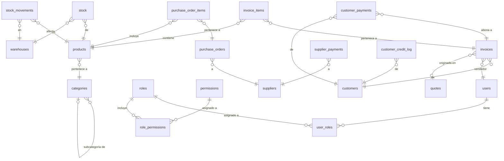

# 03 — Base de Datos

## Diagrama General (ERD)



---

## SQL — Módulo AUTH

```sql
-- Roles del sistema
CREATE TABLE roles (
    id          UUID PRIMARY KEY DEFAULT gen_random_uuid(),
    name        VARCHAR(50)  NOT NULL UNIQUE,
    description TEXT,
    is_active   BOOLEAN      NOT NULL DEFAULT TRUE,
    created_at  TIMESTAMPTZ  NOT NULL DEFAULT NOW()
);

-- Permisos granulares por módulo y acción
CREATE TABLE permissions (
    id          UUID PRIMARY KEY DEFAULT gen_random_uuid(),
    module      VARCHAR(50)  NOT NULL,
    action      VARCHAR(50)  NOT NULL,
    description TEXT,
    UNIQUE (module, action)
);

-- Relación N:N entre roles y permisos
CREATE TABLE role_permissions (
    role_id       UUID NOT NULL REFERENCES roles(id) ON DELETE CASCADE,
    permission_id UUID NOT NULL REFERENCES permissions(id) ON DELETE CASCADE,
    PRIMARY KEY (role_id, permission_id)
);

-- Usuarios del sistema
CREATE TABLE users (
    id            UUID PRIMARY KEY DEFAULT gen_random_uuid(),
    full_name     VARCHAR(100) NOT NULL,
    email         VARCHAR(150) NOT NULL UNIQUE,
    password_hash TEXT         NOT NULL,
    is_active     BOOLEAN      NOT NULL DEFAULT TRUE,
    last_login    TIMESTAMPTZ,
    created_at    TIMESTAMPTZ  NOT NULL DEFAULT NOW(),
    updated_at    TIMESTAMPTZ  NOT NULL DEFAULT NOW()
);

-- Relación N:N entre usuarios y roles (un usuario puede tener múltiples roles)
CREATE TABLE user_roles (
    user_id  UUID NOT NULL REFERENCES users(id) ON DELETE CASCADE,
    role_id  UUID NOT NULL REFERENCES roles(id) ON DELETE CASCADE,
    PRIMARY KEY (user_id, role_id)
);

-- Refresh tokens para renovar sesiones sin re-login
CREATE TABLE refresh_tokens (
    id          UUID PRIMARY KEY DEFAULT gen_random_uuid(),
    user_id     UUID        NOT NULL REFERENCES users(id) ON DELETE CASCADE,
    token_hash  TEXT        NOT NULL UNIQUE,
    expires_at  TIMESTAMPTZ NOT NULL,
    revoked     BOOLEAN     NOT NULL DEFAULT FALSE,
    created_at  TIMESTAMPTZ NOT NULL DEFAULT NOW()
);

-- Auditoría de acciones del sistema
CREATE TABLE activity_log (
    id          UUID PRIMARY KEY DEFAULT gen_random_uuid(),
    user_id     UUID         REFERENCES users(id) ON DELETE SET NULL,
    action      VARCHAR(100) NOT NULL,
    module      VARCHAR(50),
    detail      JSONB,
    ip_address  INET,
    created_at  TIMESTAMPTZ  NOT NULL DEFAULT NOW()
);

CREATE INDEX idx_users_email     ON users(email);
CREATE INDEX idx_user_roles_user ON user_roles(user_id);
CREATE INDEX idx_user_roles_role ON user_roles(role_id);
CREATE INDEX idx_refresh_token_hash  ON refresh_tokens(token_hash);
CREATE INDEX idx_activity_user       ON activity_log(user_id);
CREATE INDEX idx_activity_date       ON activity_log(created_at DESC);
```

---

## SQL — Módulo INVENTORY

```sql
-- Categorías con soporte de jerarquía (subcategorías)
CREATE TABLE categories (
    id          UUID PRIMARY KEY DEFAULT gen_random_uuid(),
    name        VARCHAR(100) NOT NULL,
    parent_id   UUID         REFERENCES categories(id) ON DELETE SET NULL,
    is_active   BOOLEAN      NOT NULL DEFAULT TRUE,
    created_at  TIMESTAMPTZ  NOT NULL DEFAULT NOW()
);

-- Catálogo de productos
CREATE TABLE products (
    id            UUID PRIMARY KEY DEFAULT gen_random_uuid(),
    code          VARCHAR(50)    NOT NULL UNIQUE,
    name          VARCHAR(150)   NOT NULL,
    description   TEXT,
    category_id   UUID           REFERENCES categories(id) ON DELETE SET NULL,
    cost_price    NUMERIC(12, 2) NOT NULL DEFAULT 0,
    sale_price    NUMERIC(12, 2) NOT NULL DEFAULT 0,
    min_stock     NUMERIC(12, 2) NOT NULL DEFAULT 0,
    unit          VARCHAR(20)    NOT NULL DEFAULT 'unit',
    is_active     BOOLEAN        NOT NULL DEFAULT TRUE,
    created_at    TIMESTAMPTZ    NOT NULL DEFAULT NOW(),
    updated_at    TIMESTAMPTZ    NOT NULL DEFAULT NOW()
);

-- Bodegas o puntos de almacenamiento
CREATE TABLE warehouses (
    id          UUID PRIMARY KEY DEFAULT gen_random_uuid(),
    name        VARCHAR(100) NOT NULL,
    location    VARCHAR(200),
    is_active   BOOLEAN      NOT NULL DEFAULT TRUE,
    created_at  TIMESTAMPTZ  NOT NULL DEFAULT NOW()
);

-- Stock actual por producto y bodega
CREATE TABLE stock (
    id           UUID PRIMARY KEY DEFAULT gen_random_uuid(),
    product_id   UUID           NOT NULL REFERENCES products(id) ON DELETE CASCADE,
    warehouse_id UUID           NOT NULL REFERENCES warehouses(id) ON DELETE CASCADE,
    quantity     NUMERIC(12, 2) NOT NULL DEFAULT 0,
    updated_at   TIMESTAMPTZ    NOT NULL DEFAULT NOW(),
    UNIQUE (product_id, warehouse_id)
);

-- Kardex: historial completo de movimientos de inventario
CREATE TABLE stock_movements (
    id              UUID PRIMARY KEY DEFAULT gen_random_uuid(),
    product_id      UUID           NOT NULL REFERENCES products(id),
    warehouse_id    UUID           NOT NULL REFERENCES warehouses(id),
    type            VARCHAR(30)    NOT NULL, -- 'in', 'out', 'adjustment', 'transfer'
    quantity        NUMERIC(12, 2) NOT NULL,
    quantity_before NUMERIC(12, 2) NOT NULL,
    ref_type        VARCHAR(30),             -- 'purchase_order', 'invoice', 'adjustment'
    ref_id          UUID,
    user_id         UUID           REFERENCES users(id) ON DELETE SET NULL,
    notes           TEXT,
    created_at      TIMESTAMPTZ    NOT NULL DEFAULT NOW()
);

CREATE INDEX idx_products_code         ON products(code);
CREATE INDEX idx_products_category     ON products(category_id);
CREATE INDEX idx_stock_product         ON stock(product_id);
CREATE INDEX idx_stock_movements_prod  ON stock_movements(product_id);
CREATE INDEX idx_stock_movements_date  ON stock_movements(created_at DESC);
```

---

## SQL — Módulo CUSTOMERS

```sql
-- Ficha de clientes con control de crédito
CREATE TABLE customers (
    id              UUID PRIMARY KEY DEFAULT gen_random_uuid(),
    code            VARCHAR(30)    NOT NULL UNIQUE,
    full_name       VARCHAR(150)   NOT NULL,
    tax_id          VARCHAR(20),
    email           VARCHAR(150),
    phone           VARCHAR(20),
    address         TEXT,
    credit_limit    NUMERIC(12, 2) NOT NULL DEFAULT 0,
    credit_balance  NUMERIC(12, 2) NOT NULL DEFAULT 0,
    credit_enabled  BOOLEAN        NOT NULL DEFAULT FALSE,
    is_active       BOOLEAN        NOT NULL DEFAULT TRUE,
    created_at      TIMESTAMPTZ    NOT NULL DEFAULT NOW(),
    updated_at      TIMESTAMPTZ    NOT NULL DEFAULT NOW()
);

-- Historial de cambios en crédito del cliente
CREATE TABLE customer_credit_log (
    id             UUID PRIMARY KEY DEFAULT gen_random_uuid(),
    customer_id    UUID           NOT NULL REFERENCES customers(id) ON DELETE CASCADE,
    type           VARCHAR(30)    NOT NULL, -- 'limit_change', 'payment', 'charge'
    amount         NUMERIC(12, 2) NOT NULL,
    balance_before NUMERIC(12, 2) NOT NULL,
    balance_after  NUMERIC(12, 2) NOT NULL,
    ref_type       VARCHAR(30),
    ref_id         UUID,
    user_id        UUID           REFERENCES users(id) ON DELETE SET NULL,
    notes          TEXT,
    created_at     TIMESTAMPTZ    NOT NULL DEFAULT NOW()
);

CREATE INDEX idx_customers_code   ON customers(code);
CREATE INDEX idx_customers_tax_id ON customers(tax_id);
```

---

## SQL — Módulo SUPPLIERS

```sql
-- Ficha de proveedores
CREATE TABLE suppliers (
    id                  UUID PRIMARY KEY DEFAULT gen_random_uuid(),
    code                VARCHAR(30)    NOT NULL UNIQUE,
    name                VARCHAR(150)   NOT NULL,
    tax_id              VARCHAR(20),
    email               VARCHAR(150),
    phone               VARCHAR(20),
    contact_name        VARCHAR(100),
    address             TEXT,
    outstanding_balance NUMERIC(12, 2) NOT NULL DEFAULT 0,
    is_active           BOOLEAN        NOT NULL DEFAULT TRUE,
    created_at          TIMESTAMPTZ    NOT NULL DEFAULT NOW(),
    updated_at          TIMESTAMPTZ    NOT NULL DEFAULT NOW()
);

-- Órdenes de compra a proveedores
CREATE TABLE purchase_orders (
    id           UUID PRIMARY KEY DEFAULT gen_random_uuid(),
    supplier_id  UUID           NOT NULL REFERENCES suppliers(id),
    user_id      UUID           REFERENCES users(id) ON DELETE SET NULL,
    status       VARCHAR(20)    NOT NULL DEFAULT 'draft', -- draft, sent, partial, received, cancelled
    total        NUMERIC(12, 2) NOT NULL DEFAULT 0,
    expected_at  DATE,
    notes        TEXT,
    created_at   TIMESTAMPTZ    NOT NULL DEFAULT NOW(),
    updated_at   TIMESTAMPTZ    NOT NULL DEFAULT NOW()
);

-- Líneas de la orden de compra
CREATE TABLE purchase_order_items (
    id                UUID PRIMARY KEY DEFAULT gen_random_uuid(),
    purchase_order_id UUID           NOT NULL REFERENCES purchase_orders(id) ON DELETE CASCADE,
    product_id        UUID           NOT NULL REFERENCES products(id),
    quantity          NUMERIC(12, 2) NOT NULL,
    quantity_received NUMERIC(12, 2) NOT NULL DEFAULT 0,
    unit_price        NUMERIC(12, 2) NOT NULL,
    subtotal          NUMERIC(12, 2) GENERATED ALWAYS AS (quantity * unit_price) STORED
);

-- Pagos registrados a proveedores
CREATE TABLE supplier_payments (
    id          UUID PRIMARY KEY DEFAULT gen_random_uuid(),
    supplier_id UUID           NOT NULL REFERENCES suppliers(id),
    amount      NUMERIC(12, 2) NOT NULL,
    method      VARCHAR(30)    NOT NULL, -- 'cash', 'transfer', 'check'
    reference   VARCHAR(100),
    user_id     UUID           REFERENCES users(id) ON DELETE SET NULL,
    paid_at     TIMESTAMPTZ    NOT NULL DEFAULT NOW(),
    created_at  TIMESTAMPTZ    NOT NULL DEFAULT NOW()
);

CREATE INDEX idx_purchase_orders_supplier ON purchase_orders(supplier_id);
CREATE INDEX idx_purchase_orders_status   ON purchase_orders(status);
```

---

## SQL — Módulo SALES

```sql
-- Cotizaciones / presupuestos
CREATE TABLE quotes (
    id          UUID PRIMARY KEY DEFAULT gen_random_uuid(),
    customer_id UUID           REFERENCES customers(id) ON DELETE SET NULL,
    user_id     UUID           REFERENCES users(id) ON DELETE SET NULL,
    status      VARCHAR(20)    NOT NULL DEFAULT 'draft', -- draft, sent, approved, rejected, expired
    subtotal    NUMERIC(12, 2) NOT NULL DEFAULT 0,
    discount    NUMERIC(12, 2) NOT NULL DEFAULT 0,
    tax         NUMERIC(12, 2) NOT NULL DEFAULT 0,
    total       NUMERIC(12, 2) NOT NULL DEFAULT 0,
    expires_at  DATE,
    notes       TEXT,
    created_at  TIMESTAMPTZ    NOT NULL DEFAULT NOW(),
    updated_at  TIMESTAMPTZ    NOT NULL DEFAULT NOW()
);

-- Líneas de cotización
CREATE TABLE quote_items (
    id         UUID PRIMARY KEY DEFAULT gen_random_uuid(),
    quote_id   UUID           NOT NULL REFERENCES quotes(id) ON DELETE CASCADE,
    product_id UUID           NOT NULL REFERENCES products(id),
    quantity   NUMERIC(12, 2) NOT NULL,
    unit_price NUMERIC(12, 2) NOT NULL,
    discount   NUMERIC(12, 2) NOT NULL DEFAULT 0,
    subtotal   NUMERIC(12, 2) NOT NULL
);

-- Facturas de venta
CREATE TABLE invoices (
    id                  UUID PRIMARY KEY DEFAULT gen_random_uuid(),
    series              VARCHAR(10)    NOT NULL,
    number              VARCHAR(20)    NOT NULL,
    customer_id         UUID           REFERENCES customers(id) ON DELETE SET NULL,
    user_id             UUID           REFERENCES users(id) ON DELETE SET NULL,
    quote_id            UUID           REFERENCES quotes(id) ON DELETE SET NULL,
    type                VARCHAR(20)    NOT NULL DEFAULT 'invoice', -- invoice, credit_note
    status              VARCHAR(20)    NOT NULL DEFAULT 'issued',  -- issued, paid, partial, cancelled
    subtotal            NUMERIC(12, 2) NOT NULL DEFAULT 0,
    discount            NUMERIC(12, 2) NOT NULL DEFAULT 0,
    tax                 NUMERIC(12, 2) NOT NULL DEFAULT 0,
    total               NUMERIC(12, 2) NOT NULL DEFAULT 0,
    outstanding_balance NUMERIC(12, 2) NOT NULL DEFAULT 0,
    payment_method      VARCHAR(30)    NOT NULL DEFAULT 'cash', -- cash, credit, transfer
    notes               TEXT,
    issued_at           TIMESTAMPTZ    NOT NULL DEFAULT NOW(),
    created_at          TIMESTAMPTZ    NOT NULL DEFAULT NOW(),
    updated_at          TIMESTAMPTZ    NOT NULL DEFAULT NOW(),
    UNIQUE (series, number)
);

-- Líneas de factura
CREATE TABLE invoice_items (
    id         UUID PRIMARY KEY DEFAULT gen_random_uuid(),
    invoice_id UUID           NOT NULL REFERENCES invoices(id) ON DELETE CASCADE,
    product_id UUID           NOT NULL REFERENCES products(id),
    quantity   NUMERIC(12, 2) NOT NULL,
    unit_price NUMERIC(12, 2) NOT NULL,
    discount   NUMERIC(12, 2) NOT NULL DEFAULT 0,
    subtotal   NUMERIC(12, 2) NOT NULL
);

-- Pagos recibidos de clientes (soporta pagos parciales)
CREATE TABLE customer_payments (
    id          UUID PRIMARY KEY DEFAULT gen_random_uuid(),
    invoice_id  UUID           NOT NULL REFERENCES invoices(id),
    customer_id UUID           NOT NULL REFERENCES customers(id),
    amount      NUMERIC(12, 2) NOT NULL,
    method      VARCHAR(30)    NOT NULL, -- 'cash', 'transfer', 'card'
    reference   VARCHAR(100),
    user_id     UUID           REFERENCES users(id) ON DELETE SET NULL,
    paid_at     TIMESTAMPTZ    NOT NULL DEFAULT NOW(),
    created_at  TIMESTAMPTZ    NOT NULL DEFAULT NOW()
);

CREATE INDEX idx_invoices_customer        ON invoices(customer_id);
CREATE INDEX idx_invoices_status          ON invoices(status);
CREATE INDEX idx_invoices_issued_at       ON invoices(issued_at DESC);
CREATE INDEX idx_invoices_series_num      ON invoices(series, number);
CREATE INDEX idx_customer_payments_invoice ON customer_payments(invoice_id);
```

---

## Decisiones de Diseño

| Patrón | Dónde | Razón |
|--------|-------|-------|
| `UUID` como PK | Todas las tablas | Seguridad, no expone IDs secuenciales, facilita distribución |
| `is_active` (soft delete) | `products`, `customers`, `suppliers`, `users` | Preservar historial sin eliminar registros |
| `outstanding_balance` en `invoices` | Ventas | Evitar JOIN costoso para saber si una factura tiene saldo |
| `quantity_before` en `stock_movements` | Inventario | Auditoría completa sin recalcular el kardex |
| `ref_type` + `ref_id` en movimientos | Inventario | Referencia polimórfica: saber el origen de cada movimiento |
| `credit_balance` en `customers` | Clientes | Saldo de crédito usado, actualizado en cada factura/pago |
| `GENERATED ALWAYS AS` en `subtotal` | `purchase_order_items` | Columna calculada automáticamente por PostgreSQL |
