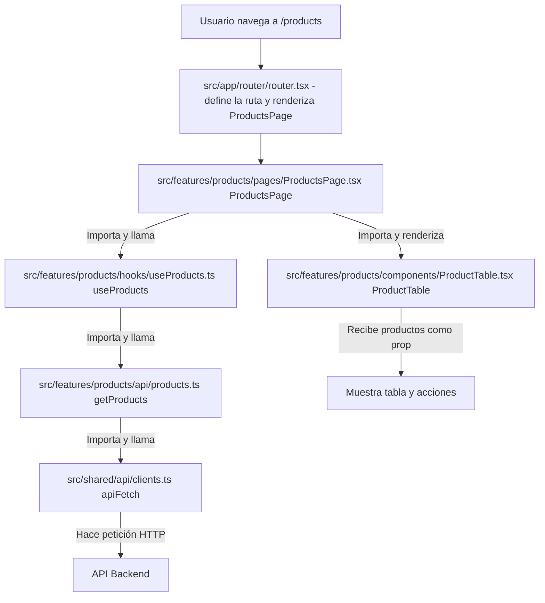

# Documentación de la Estructura del Proyecto Frontend

## Estructura de Carpetas

El frontend del proyecto sigue una estructura modular basada en features, lo que facilita la escalabilidad y el mantenimiento. A continuación se describe la estructura principal:

```
frontend/
├── Dockerfile
├── index.html
├── package.json
├── README.md
├── tsconfig.json
├── tsconfig.node.json
├── vite.config.js
├── public/
├── src/
│   ├── app.tsx
│   ├── main.tsx
│   ├── vite-env.d.ts
│   ├── app/
│   │   └── router/
│   │       └── router.tsx
│   ├── features/
│   │   ├── products/
│   │   │   ├── components/
│   │   │   ├── hooks/
│   │   │   └── pages/
│   │   │       └── ProductsPage.tsx
│   │   └── TicTacToePage/
│   │       └── page/
│   │           └── TicTacToePage.tsx
│   ├── shared/
│   └── styles/
```

router = es el archivo que define la navegación de toda la app con React Router.
    Se usa para:

    1.Crear el router con createBrowserRouter(...).
    2.Declarar qué componente se renderiza en cada URL.
    3.Definir rutas anidadas bajo / usando el layout principal (<App />).
    4.Registrar rutas de products (/products, /products/new, /products/:id, /products/:id/edit).
    5.Registrar rutas de otros features, por ejemplo /tictactoe.
    6.Exponer <RouterProvider router={router} />, que activa el sistema de rutas en toda la app.

pages = pantallas completas asociadas a rutas.
components = piezas reutilizables dentro de una página.
hooks = se usan para encapsular lógica reutilizable y separar esa lógica de la UI.
api = se usa para centralizar las llamadas HTTP al backend.

    Recomendación práctica:

    Un archivo por módulo/feature (o recurso) del backend.
    Si crece mucho, dividir ese módulo en varios archivos por operación.

    Ejemplo sano:
    features/products/api/products.ts
    features/categories/api/categories.ts
    features/clients/api/clients.ts

types -> types/ sirve para definir los tipos de TypeScript del dominio (formas de datos).

    En tu caso, por ejemplo en products/types:

    - Define cómo es un Product.
    - Define payloads como CreateProductPayload o similares.
    - Asegura que api, hooks, components y pages usen la misma estructura de datos.
    - Evita errores comunes (campos faltantes, tipos incorrectos) desde el editor/compilación.


main.tsx 
    -> app.tsx 
        -> router.tsx 
            -> pages/ProductsPage.tsx (pages can call logic and components)
                -> components/ProdcutTable.tsx (components)<------------------------|
                    -> types/product.types.ts                                       |
                    -> hooks/useDeleteProduct.ts -> useDeleteProduct()              |
                        ->api/products.ts->deleteProduct                            |
                -> hooks/useProducts.ts (logic)-------------------------------------|
                    -> api/products.ts >>> getProducts() 


## Propósito de las Carpetas Principales

- **public/**: Archivos estáticos públicos (imágenes, favicon, etc.).
- **src/**: Código fuente principal de la aplicación.
  - **app.tsx / main.tsx**: Punto de entrada de la aplicación y montaje del router.
  - **app/router/**: Configuración centralizada de rutas usando React Router.
  - **features/**: Cada feature representa un dominio funcional independiente (ej: products, TicTacToePage). Dentro de cada feature:
    - **components/**: Componentes reutilizables específicos del feature.
    - **hooks/**: Hooks personalizados relacionados al feature.
    - **pages/**: Páginas principales del feature, normalmente asociadas a rutas.
  - **shared/**: Componentes, utilidades o hooks compartidos entre features.
  - **styles/**: Archivos de estilos globales o específicos.

## Ejemplo: Feature Products

```
features/
└── products/
    ├── components/
    │   └── ProductTable.tsx
    ├── hooks/
    │   └── useProducts.ts
    └── pages/
        ├── ProductsPage.tsx
        ├── ProductCreatePage.tsx
        ├── ProductDetailPage.tsx
        └── ProductEditPage.tsx
```

- **components/ProductTable.tsx**: Tabla para mostrar productos.
- **hooks/useProducts.ts**: Hook para obtener y manejar datos de productos.
- **pages/**: Cada archivo representa una página:
  - **ProductsPage.tsx**: Lista de productos.
  - **ProductCreatePage.tsx**: Formulario para crear un producto.
  - **ProductDetailPage.tsx**: Detalle de un producto.
  - **ProductEditPage.tsx**: Edición de un producto.

## Diagrama de flujo detallado del feature products



**Explicación del flujo:**
- El usuario navega a `/products`, el router (router.tsx) renderiza `ProductsPage.tsx`.
- `ProductsPage.tsx` usa el hook `useProducts.ts` para obtener los productos.
- `useProducts.ts` llama a la función `getProducts` de `api/products.ts`.
- `getProducts` usa `apiFetch` de `shared/api/clients.ts` para hacer la petición HTTP al backend.
- Cuando los datos llegan, `ProductsPage.tsx` renderiza el componente `ProductTable.tsx` pasándole los productos como prop.
- `ProductTable.tsx` muestra la tabla y permite acciones como eliminar productos.

## Flujo de la Aplicación

1. **main.tsx** monta el componente principal (`<App />`) y el router.
2. **router.tsx** define todas las rutas de la aplicación y qué página renderiza cada una.
3. Cuando el usuario navega a `/products`, se renderiza `ProductsPage`.
4. `ProductsPage` utiliza el hook `useProducts` para obtener los datos y renderiza el componente `ProductTable`.
5. Desde la tabla o botones, el usuario puede navegar a crear, editar o ver detalles de productos, cada uno con su propia página.

## Ventajas de esta Estructura
- Modularidad: Cada feature es independiente y fácil de mantener.
- Escalabilidad: Agregar nuevas features o páginas es sencillo.
- Reutilización: Componentes y hooks pueden compartirse entre features o estar en `shared/`.

---

Esta estructura permite un desarrollo organizado y profesional, facilitando el trabajo en equipo y la extensión del proyecto.